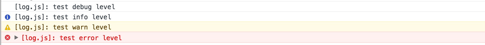

# log.js
Log tool, provides a simple API, can be configured level, to determine the log output

## Get Started

### Install

```html
<script src="../si_log.js" charset="utf-8"></script>
```

or

```shell
npm install si-log --save
```

### Use

Simple

```javascript
siLog.debug('test debug level');
siLog.info('test info level');
siLog.warn('test warn level');
siLog.error('test error level');
```



CommonJs

```javascript
var siLog = require('si-log')
siLog.debug('test debug level');
siLog.info('test info level');
siLog.warn('test warn level');
siLog.error('test error level');
```

ES6

```javascript
import siLog from 'si-log'

siLog.debug('test debug level');
siLog.info('test info level');
siLog.warn('test warn level');
siLog.error('test error level');
```
### Configure output

```javascript
siLog.config({
  level: true
}); // output all level
siLog.config({
  level: false
}); // No output
siLog.config({
  level: ['error']
});  // only output error level
siLog.config({
  level: ['error', 'warn']
});  // only output error or warn
```

### Under different js file to use

```javascript
// render.js
var log = siLog.create('render.js')
log.debug('test in render.js output')

// [render.js]: test in render.js output
```

### Configure appender

```javascript
siLog.config({
  appenders: {
    // console
    console: {
        printTime: true
    }
    // ...more
  }
})
```

### more appender

```javascript
siLog.appender('test', fucntion (op) {
  return function (logInfo) {
    document.write('name:' + loginfo.name);
    if (op.printTime) document.write('time:' + loginfo.timeStr);
    document.write('args:' + JSON.stringify(logInfo.args));
  }
});

siLog.config({
  appenders: {
    test: {             // use test output log
      printTime: true
    }
  }
})
```

## API

### debug([args])

equal `console.log`

### info([args])

equal `console.info`

### warn([args])

equal `console.warn`

### error([args])

equal `console.error`

### create([name])

create new Log instance

### appender([name, appender])

register a appender

### config(options)

change config

## License

[MIT](http://opensource.org/licenses/MIT)

Copyright (c) 2016 myron
